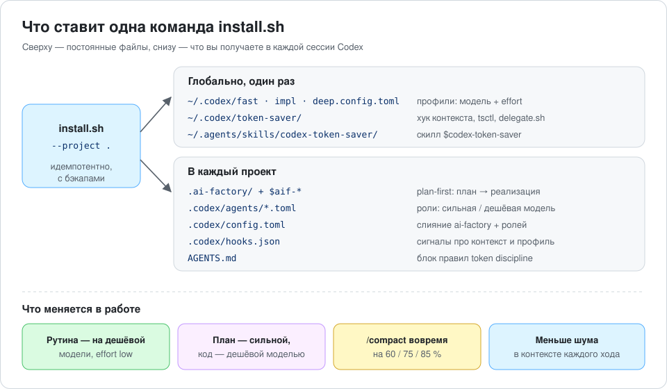
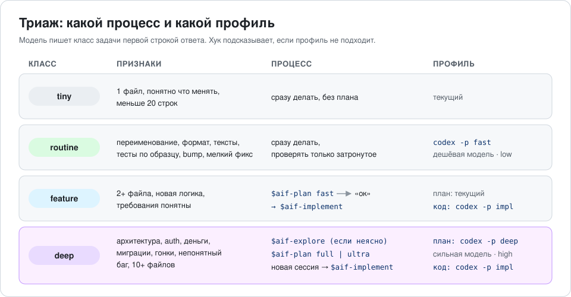
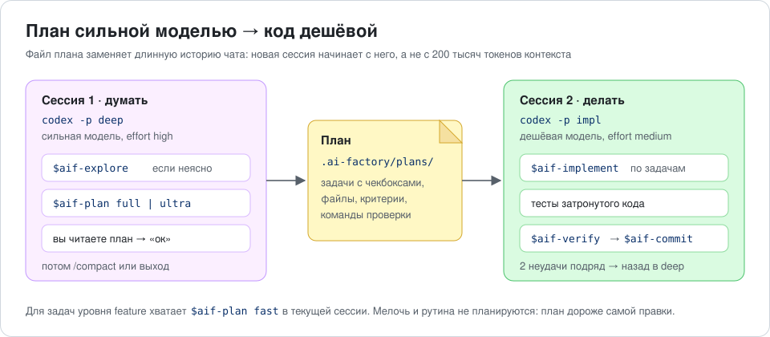
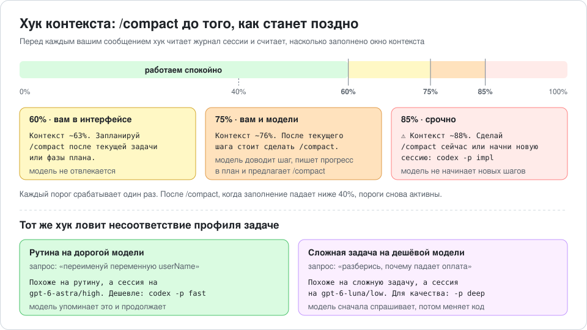
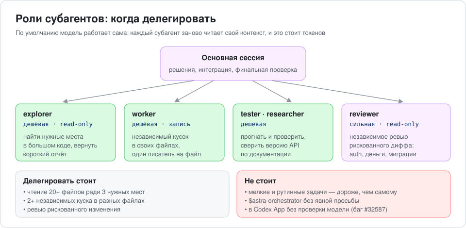

# Digital Growth Token Saver

**Скилл и установщик для OpenAI Codex, которые снижают расход токенов без потери качества.**
Дорогая модель думает, дешёвая делает, а контекст не раздувается до лимита.




---

## Содержание

- [Зачем это нужно](#зачем-это-нужно)
- [Что внутри](#что-внутри)
- [Быстрый старт](#быстрый-старт)
- [Как это работает](#как-это-работает)
  - [1. Триаж задачи и профили](#1-триаж-задачи-и-профили)
  - [2. План сильной моделью, код дешёвой](#2-план-сильной-моделью-код-дешёвой)
  - [3. Хук контекста и /compact](#3-хук-контекста-и-compact)
  - [4. Роли и делегирование](#4-роли-и-делегирование)
  - [5. Правила в AGENTS.md](#5-правила-в-agentsmd)
- [Команды на каждый день](#команды-на-каждый-день)
- [Опции установщика](#опции-установщика)
- [Что меняется на диске](#что-меняется-на-диске)
- [Не пострадает ли качество](#не-пострадает-ли-качество)
- [Проверка и замер экономии](#проверка-и-замер-экономии)
- [Частые вопросы](#частые-вопросы)
- [Удаление](#удаление)
- [Благодарности](#благодарности)

---

## Зачем это нужно

В Codex токены чаще всего уходят не на полезное мышление, а на обвязку:

| Куда уходят токены | Что с этим делает Token Saver |
|---|---|
| Флагманская модель с высоким effort делает рутину: переименования, тексты, тесты по образцу | профиль `fast` и подсказка хука переключиться |
| Длинная сессия тащит за собой сотни тысяч токенов старой истории | план в файле, короткие сессии, `/compact` вовремя |
| Модель долго исследует код, потому что задача размыта | plan-first через [ai-factory](https://github.com/lee-to/ai-factory) |
| Субагенты запускаются там, где проще сделать самому | правила делегирования и роли с закреплёнными моделями |
| В контекст льётся шумный вывод команд | правила чтения и вывода в AGENTS.md |

Главный принцип: **экономить на шуме, а не на мышлении**. Безопасность, деньги, миграции,
конкурентность и непонятные баги всегда остаются на сильной модели.

## Что внутри

Проект объединяет два open-source инструмента и добавляет к ним связующий слой:

| Слой | Откуда | Что даёт |
|---|---|---|
| **Plan-first** | [lee-to/ai-factory](https://github.com/lee-to/ai-factory) | `$aif-plan` → `$aif-implement`: план в файле, реализация по чекбоксам |
| **Роли** | [donvito/codex-astra-luna-orchestrator](https://github.com/donvito/codex-astra-luna-orchestrator) | `explorer`, `worker`, `tester`, `researcher` на дешёвой модели, `reviewer` на сильной |
| **Профили** | этот репо | `fast`, `impl`, `deep`: модель и effort под тип задачи |
| **Хук контекста** | этот репо | сигналы на 60/75/85% и подсказки, когда профиль не подходит задаче |
| **Правила** | этот репо | блок token discipline в AGENTS.md и скилл `$codex-token-saver` |
| **Делегирование** | этот репо | `delegate.sh`: рутина в отдельном `codex exec` с проверкой, какая модель реально ответила |

## Быстрый старт

**Что нужно:** macOS или Linux, Codex CLI или App, `git`, `npm` (для ai-factory),
`python3` версии 3.11 или новее. На macOS: `brew install python@3.12`.

```bash
git clone https://github.com/ikrivopustov-lgtm/digital-growth-token-saver.git
cd digital-growth-token-saver

# 1. Посмотреть, что будет сделано. Ничего не меняется.
bash scripts/install.sh --project ~/code/my-repo --dry-run

# 2. Установить.
bash scripts/install.sh --project ~/code/my-repo
```

Потом в проекте:

```bash
cd ~/code/my-repo
codex          # при первом запуске отметить проект как trusted
/status        # проверить модель и effort
$aif           # ai-factory один раз описывает проект
```

Для следующих проектов клонировать репо не нужно, установщик уже лежит у вас:

```bash
bash ~/.codex/token-saver/install.sh --project ~/code/other-repo
```

> [!IMPORTANT]
> Codex читает `.codex/config.toml` и `.codex/hooks.json` только в **trusted**-проектах.
> Если хук молчит, а роли не видны, сначала проверьте это.

> [!NOTE]
> По умолчанию модели называются `gpt-6-astra` (сильная) и `gpt-6-luna` (дешёвая).
> Если в `/model` у вас другие названия, передайте их: `--strong <model> --cheap <model>`.

## Как это работает

### 1. Триаж задачи и профили

На задачах с кодом модель первой строкой пишет класс задачи, например
`Класс: routine · профиль: fast · план: нет`. От класса зависит процесс и профиль.

| Класс | Что делать |
|---|---|
| tiny, routine | сразу, без плана |
| feature (меньше ~20 ответов) | сразу на модели по умолчанию (Sol или Luna), без отдельного плана |
| big (20+ ответов), deep | план на сильной модели → реализация в новой сессии на дешёвой |



Профиль — это файл с моделью и effort. С Codex 0.134 профили хранятся отдельными файлами:

| Профиль | Файл | Модель | Effort | Когда |
|---|---|---|---|---|
| `fast` | `~/.codex/fast.config.toml` | дешёвая | `low` | рутина, мелкие правки; субагенты выключены |
| `impl` | `~/.codex/impl.config.toml` | дешёвая | `medium` | реализация готового плана |
| `deep` | `~/.codex/deep.config.toml` | сильная | `high` | планирование, архитектура, сложные баги |

Модель не может сама сменить профиль, поэтому она подсказывает вам готовую команду:
`codex -p fast` или `/model …`.

> [!WARNING]
> Профили `-p fast|impl|deep` работают **только в CLI** (`codex -p …`, `codex exec -p …`).
> В приложении Codex их выбрать нельзя: модель выбирается в списке моделей, а по умолчанию
> берётся из `~/.codex/config.toml` — её задаёт `--default-model` (см. [глобальный режим](#модель-по-умолчанию-и-правила-для-всех-чатов)).
> Иначе профили молча не используются: так и было в журналах автора — все чаты приложения
> шли на модели по умолчанию.

### 2. План сильной моделью, код дешёвой

Это источник экономии **только на больших задачах** (deep или ожидается 20+ ответов).
На коротких задачах план съедает всю выгоду: в замере на задаче в 7 ответов план на Astra
стоил столько же, сколько вся задача на Astra (+5% лимита против +5%), а схема
«план на Astra + код на Luna» вышла в +6%. Небольшие фичи выгоднее сразу делать на модели
по умолчанию (Sol или Luna) без отдельного плана.

Сильная модель пишет подробный план,
вы его одобряете, и в **новой** сессии дешёвая модель выполняет его по пунктам.



Почему это работает:

- **Новая сессия начинается с короткого файла плана**, а не с истории на сотни тысяч токенов.
- Режим `ultra` в ai-factory задуман именно для этого: он пишет план настолько подробно,
  что по нему может работать более слабая модель.
- Если сессия прервалась, по чекбоксам в плане видно, где продолжить.

Когда план не нужен: мелочь, рутина и небольшие фичи. План стоит дороже самой правки.

### 3. Хук контекста и /compact

Команду `/compact` может запустить только пользователь, поэтому важно вовремя о ней напомнить.
Перед каждым вашим сообщением хук `context_guard.py` читает журнал сессии, считает
заполнение окна контекста и на порогах выводит подсказку.



- **60%** — подсказка только вам, модель не отвлекается.
- **75%** — модель доводит текущий шаг, записывает прогресс в план и предлагает `/compact`.
- **85%** — модель не начинает новых шагов и первой строкой просит сделать `/compact`.
- Каждый порог срабатывает один раз. После `/compact` пороги снова активны.
- Хук никогда не блокирует запрос. Если что-то пошло не так, он просто молчит.

Пороги и модели настраиваются в `~/.codex/token-saver/settings.json`.

### 4. Роли и делегирование

Субагенты помогают, но **не бесплатно**: каждый заново читает свой контекст, а основная
сессия всё это время живёт и тоже тратит токены. В замере автора ролей один небольшой
багфикс с четырьмя субагентами занял 66% пятичасового лимита. Поэтому по умолчанию
модель работает сама, а делегирует только там, где это окупается.



Для изолированной рутины есть `delegate.sh`. Он запускает отдельный `codex exec`
на профиле `fast` и после выполнения проверяет, какая модель реально отработала:

```bash
bash ~/.codex/token-saver/delegate.sh "найди все места, где читается API_KEY, верни file:line"
bash ~/.codex/token-saver/delegate.sh -w "добавь docstring во все публичные функции src/utils/"
```

```text
→ codex exec -p fast --sandbox read-only (ожидаемая модель: gpt-6-luna)
← код выхода: 0 · ответ: .codex/delegate/20260926-101440.md
модель: gpt-6-luna ✓
```

Если модель оказалась другой, будет `MODEL MISMATCH`. Это защита от
[бага Codex App #32587](https://github.com/openai/codex/issues/32587): в приложении
субагенты могут молча работать на дорогой модели родителя.

### 5. Правила в AGENTS.md

Установщик добавляет в `AGENTS.md` блок между маркерами
`<!-- codex-token-saver:start -->` и `<!-- codex-token-saver:end -->`. Остальное
содержимое файла не трогается. Блок занимает около 3 КБ и читается моделью каждый ход:

- сначала поиск (`rg`), потом нужный диапазон строк; неизменённые файлы не перечитываются;
- не заходить в `node_modules/`, `dist/`, lock-файлы, логи и дампы;
- успешные команды выводить коротко; упавшие — **блок ошибки целиком**;
- тесты затронутого кода всегда, полный прогон перед коммитом;
- на безопасности, деньгах и миграциях не экономить.

Полный текст: [`templates/AGENTS.token-discipline.md`](templates/AGENTS.token-discipline.md).

## Команды на каждый день

| Задача | Команда |
|---|---|
| Рутина | `codex -p fast` |
| Спланировать сложную задачу | `codex -p deep`, затем `$aif-plan full` или `$aif-plan ultra` |
| Небольшая фича | сразу, без плана, на модели по умолчанию |
| Реализовать план | `codex -p impl`, затем `$aif-implement` |
| Проверить и закоммитить | `$aif-verify`, затем `$aif-commit` |
| Отдать рутину в фон | `bash ~/.codex/token-saver/delegate.sh "…"` |
| Состояние сетапа | `~/.codex/token-saver/tsctl status --project .` |
| Процедуры скилла в Codex | `$codex-token-saver` |

Пример вывода `status`:

```text
Проект: ~/code/my-repo
  ✓ settings: strong=gpt-6-astra cheap=gpt-6-luna
  ✓ профиль fast: gpt-6-luna / low
  ✓ профиль impl: gpt-6-luna / medium
  ✓ профиль deep: gpt-6-astra / high
  ✓ .codex/config.toml: root=gpt-6-astra/medium subagent=gpt-6-luna depth=2 hooks=True
  ✓ роли:
      explorer                 gpt-6-luna       medium   read-only
      reviewer                 gpt-6-astra      low      read-only
      worker                   gpt-6-luna       medium   workspace-write
  ✓ хук context_guard
  ✓ AGENTS.md блок (2933 байт)
  ✓ ai-factory
  ✓ скиллы $aif-*   · $astra-orchestrator
```

## Опции установщика

```bash
bash scripts/install.sh --project <repo> [опции]
```

| Опция | По умолчанию | Что делает |
|---|---|---|
| `--project DIR` | `.` | проект, куда ставить |
| `--astra PROFILE` | `pro` | набор ролей: `pro`, `plus`, `pro-max-2-subagents`, `plus-max-2-subagents`, `GPT6-SolMax-LunaMax`, `GPT6-SolMedium-LunaMax`. На подписке Plus берите `plus` |
| `--strong MODEL` | `gpt-6-astra` | сильная модель |
| `--cheap MODEL` | `gpt-6-luna` | дешёвая модель |
| `--role-effort E` | `medium` | effort ролей на дешёвой модели. В исходном `pro` стоит `max`, это дорого |
| `--align-aif-models` | выкл. | агенты ai-factory: планирование и security на сильной модели, реализация и проверки на дешёвой |
| `--with-orchestrator-skill` | выкл. | поставить `$astra-orchestrator`, но только для явного вызова |
| `--keep-model` | выкл. | не менять модель основной сессии в `.codex/config.toml` |
| `--aif-agents LIST` | `codex` | для `ai-factory init`; можно `codex,codex-app` |
| `--skip-aif`, `--skip-astra`, `--skip-hooks` | — | пропустить часть установки |
| `--force` | выкл. | перезаписать существующие профили и роли (с бэкапом) |
| `--yes` | выкл. | не задавать вопросов |
| `--dry-run` | выкл. | только показать план изменений |
| `--default-model MODEL` | — | модель по умолчанию в `~/.codex/config.toml` (например `gpt-6-sol` или `gpt-6-luna`). Остальные ключи сохраняются, делается бэкап |
| `--default-effort E` | `medium` | effort к `--default-model` |
| `--global-rules` | выкл. | блок правил в `~/.codex/AGENTS.md` и хук в `~/.codex/hooks.json`: работают в любом чате, в том числе в чатах приложения вне проектов |
| `--no-project` | выкл. | только глобальная часть, проект не трогать |

### Модель по умолчанию и правила для всех чатов

Модель чата сама не переключается: хук может только добавить текст к запросу, а профили `-p`
работают только в терминале. Поэтому экономия достигается двумя способами:

1. **Дешёвая модель по умолчанию** (`--default-model`). На сильную переходите вручную через `/model`
   или список моделей в приложении. Если задача сложная, а модель не сильная (Luna, Sol и т.п.),
   хук подскажет переключиться.
2. **Правила и хук для всех чатов** (`--global-rules`). Приложение создаёт чаты вне проектов,
   где проектного AGENTS.md и хука нет. Глобальный блок (~2 КБ) и хук работают везде.
   Хук нужно один раз одобрить в `/hooks`. Если хук стоит и глобально, и в проекте, сообщение
   придёт одно; новые проекты при глобальном хуке своего хука не получают.

```bash
bash ~/.codex/token-saver/install.sh --no-project --default-model gpt-6-sol --global-rules --dry-run
```

Перед установкой закройте приложение Codex: оно само пишет в `~/.codex/config.toml`
(plugins, trust проектов). Установщик правит в этом файле только свои строки.

Эти флаги по умолчанию выключены: без них установщик глобальный `config.toml`, `AGENTS.md`
и `hooks.json` не трогает.

## Что меняется на диске

| Где | Что | Как откатить |
|---|---|---|
| `~/.codex/{fast,impl,deep}.config.toml` | профили | удалить файлы |
| `~/.codex/token-saver/` | `tsctl`, `context_guard.py`, `delegate.sh`, `settings.json`, копия ролей donvito | удалить папку |
| `~/.agents/skills/codex-token-saver/` | скилл `$codex-token-saver` | удалить папку |
| `~/.codex/config.toml` | только с `--default-model` / `--global-rules`: точечно меняются только `model`, `model_reasoning_effort`, `features.hooks`; остальной текст, комментарии, plugins и trust проектов не трогаются | `config.toml.bak-*` |
| `~/.codex/AGENTS.md`, `~/.codex/hooks.json` | только с `--global-rules`: блок правил и хук | `*.bak-*` или удалить блок/запись |
| `<repo>/.ai-factory/`, `.codex/skills/` | ai-factory: план, скиллы `$aif-*` | по [документации ai-factory](https://github.com/lee-to/ai-factory) |
| `<repo>/.codex/config.toml` | слияние: ключи ai-factory сохраняются, модели берутся из ролей, включаются хуки | `config.toml.bak-*` |
| `<repo>/.codex/agents/*.toml` | роли рядом с агентами ai-factory, имена не пересекаются | удалить 5 файлов ролей |
| `<repo>/.codex/hooks.json` | подключение `context_guard.py` | удалить запись |
| `<repo>/AGENTS.md` | блок между маркерами | `AGENTS.md.bak-*` или удалить блок |
| `<repo>/.gitignore` | бэкапы и `.codex/delegate/` | удалить 3 строки |

Установка идемпотентна: повторный запуск ничего не меняет, а любая запись в конфиг
сначала делает бэкап. `ai-factory update` не перезаписывает слитый `.codex/config.toml`
(проверено на ai-factory 2.19.0).

## Не пострадает ли качество

Коротко: не пострадает, если соблюдать правила. Вот где какой риск и чем он закрыт.

| Механизм | Экономия | Риск для качества | Чем закрыт |
|---|---|---|---|
| Правила в AGENTS.md | средняя | низкий | упавшая команда показывается целиком; догадки вместо чтения файла запрещены |
| `/compact` по сигналу хука | средняя на длинных сессиях | низкий–средний: компакт теряет детали | сначала прогресс записывается в план; во время отладки не компактить; лимиты авто-компакта не трогаются |
| Профиль `fast` на рутине | высокая | средний: `low` может ошибиться | хук подсказывает и обратное переключение; 2 неудачи подряд → `deep`; чувствительные зоны всегда на сильной модели |
| Plan-first | меньше переделок на больших задачах | низкий, чаще улучшает результат | план только для deep и задач на 20+ ответов; остальное сразу |
| План сильной → код дешёвой | высокая на больших задачах, нулевая на коротких | низкий по замеру (ниже) | только для deep и 20+ ответов; `$aif-verify` и тесты перед коммитом |
| Субагенты | может быть **отрицательной** на мелких задачах | низкий | по умолчанию модель работает сама; `$astra-orchestrator` только по явной просьбе |
| `delegate.sh` | высокая для изолированной рутины | низкий | только чтение по умолчанию, без вложенных агентов, проверка фактической модели |

**Замер автора.** Luna (effort medium) по плану от Astra прошла **27 из 27** скрытых тестов —
так же, как Astra, делавшая задачу целиком. Разница в расходе считается по лимиту подписки,
а не по ценам API:

| Модель | Токенов на 1% 5-часового окна |
|---|---|
| Luna | ~556k |
| Astra | 26–84k |

Реальный разрыв — примерно в **15–20 раз** (цены API дают заметно больше, но на подписке
считается именно лимит). Замер один, на своей задаче — перепроверьте у себя.

Чего проект **сознательно не делает**:

- не уменьшает `tool_output_token_limit`, потому что это прячет ошибки;
- не уменьшает `model_auto_compact_token_limit`, потому что частые компакты теряют детали;
- не включает субагентов автоматически;
- не обещает конкретный процент экономии без вашего замера.

## Проверка и замер экономии

1. **После установки:** `~/.codex/token-saver/tsctl status --project .`, затем `/status` в Codex.
2. **После сессии с субагентами** проверьте, на каких моделях реально работали роли:
   ```bash
   python3 ~/.codex/token-saver/vendor/codex-astra-luna-orchestrator/scripts/token_usage.py --latest
   ```
3. **Экономия:** снимите расход до установки и через неделю:
   ```bash
   npx ccusage@latest codex --period daily
   ```
4. **Тесты проекта** работают без сети и без настоящего Codex:
   ```bash
   bash tests/smoke.sh
   ```

## Частые вопросы

<details>
<summary><b>Хук ничего не показывает</b></summary>

- Проект должен быть trusted.
- В `.codex/config.toml` должно быть `[features] hooks = true`, это ставит установщик.
- Первое сообщение хук увидит только после 60% заполнения или при явном несоответствии профиля.
  Это нормально: он молчит, пока всё в порядке.
</details>

<details>
<summary><b>Роли работают на дорогой модели</b></summary>

В Codex App есть баг [#32587](https://github.com/openai/codex/issues/32587).
Проверьте через `token_usage.py --latest`. Для рутины в App надёжнее `delegate.sh`.
В CLI роли работают корректно.
</details>

<details>
<summary><b>У меня другие названия моделей</b></summary>

```bash
bash ~/.codex/token-saver/install.sh --project . --strong <сильная> --cheap <дешёвая> --force
```
</details>

<details>
<summary><b>Рутина на fast получается с ошибками</b></summary>

Поднимите effort в `~/.codex/fast.config.toml` с `low` до `medium`. Экономия станет меньше,
но всё равно заметной по сравнению с сильной моделью.
</details>

<details>
<summary><b>Можно ли коммитить .codex/hooks.json в общий репозиторий?</b></summary>

Хук ссылается на `~/.codex/token-saver/`. У коллег без установленного Token Saver он не
найдёт скрипт. Либо не коммитьте `hooks.json`, либо попросите коллег запустить установщик.
</details>

<details>
<summary><b>Нужен ли ai-factory обязательно?</b></summary>

Нет. `--skip-aif` поставит всё остальное. Но план в файле — главный способ держать сессии
короткими, поэтому без него экономия будет меньше.
</details>

## Удаление

```bash
rm -rf ~/.agents/skills/codex-token-saver ~/.codex/token-saver
rm -f ~/.codex/fast.config.toml ~/.codex/impl.config.toml ~/.codex/deep.config.toml
# в проекте: вернуть .codex/config.toml.bak-*, удалить блок из AGENTS.md и .codex/hooks.json
```

## Структура репозитория

```text
digital-growth-token-saver/
├── SKILL.md                         # скилл $codex-token-saver для Codex
├── references/                      # подробности: делегирование, ограничители качества
├── templates/
│   ├── AGENTS.token-discipline.md   # блок правил для AGENTS.md
│   └── profiles/                    # fast / impl / deep
├── scripts/
│   ├── install.sh                   # установщик
│   ├── tsctl.py                     # слияние конфигов, AGENTS.md, хуки, status
│   ├── context_guard.py             # хук контекста и профиля
│   └── delegate.sh                  # рутина через codex exec с проверкой модели
├── tests/smoke.sh                   # 15 проверок без сети
└── docs/images/                     # схемы из этого README
```

## Благодарности

- [lee-to/ai-factory](https://github.com/lee-to/ai-factory) — plan-first процесс и скиллы `$aif-*`
- [donvito/codex-astra-luna-orchestrator](https://github.com/donvito/codex-astra-luna-orchestrator) (Apache-2.0) — роли с закреплёнными моделями и скрипт `token_usage.py`
- [Документация Codex](https://developers.openai.com/codex): субагенты, хуки, конфигурация

Оба проекта подтягиваются установщиком из своих репозиториев и не входят в этот код.

## Лицензия

[MIT](LICENSE)
